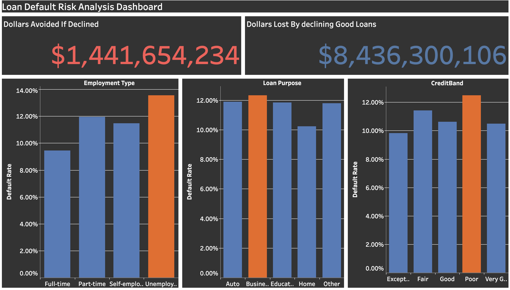

# Loan Default Risk Analysis

A multi-tool analysis of loan default risk using a 255,347-row lending dataset, built to answer seven real business questions a lending team would actually ask, and to test whether a common lending decision (declining high-risk borrowers) would actually make financial sense.

**Tools used:** SQL, Python, Excel, Power BI, Tableau

## The Business Question

Which borrower and loan factors actually predict default, and would tightening lending standards based on those factors make good business sense?

## The Headline Finding

Declining every loan with Poor credit AND Very High DTI would avoid **$1.44 billion** in eventual defaults, but would also turn away **$8.44 billion** in loans from borrowers who paid back just fine. That's **$5.85 lost in good business for every $1 saved.**

**Blanket declining based on these two factors would be a bad business decision.**

## Key Findings

Six borrower and loan factors were tested for predictive strength, ranked here from strongest to weakest, and confirmed using three independent methods (SQL spread analysis, Python correlation, and a multivariate logistic regression):

| Rank | Factor | Strength | Takeaway |
|---|---|---|---|
| 1 | Interest Rate | Strongest | Not explained by credit score or DTI, likely a dataset artifact rather than real-world pricing behavior (see Limitations) |
| 2 | Employment Status | Strong | Statistically significant, holds up even when controlling for other factors |
| 3 | Credit Score | Weak-Moderate | Directionally correct but not a strong standalone predictor |
| 4 | Has Co-Signer | Weak-Moderate | Reduces risk, direct legal backup on the loan |
| 5 | DTI Ratio | Weak | Barely moves the needle, weaker than expected |
| 6 | Has Mortgage | Weakest | Indirect signal only |

**The bigger picture:** no single factor, or even a combination of two, strongly separates risky borrowers from safe ones in this dataset. Simple rule-based lending decisions would do more harm than good here, real risk assessment needs to weigh several factors together.

## Repository Structure

```
loan-default-risk-analysis/
├── README.md
├── sql/
│   └── queries.sql          All 7 business question queries
├── python/
│   └── analysis.ipynb        Correlation, chi-square test, logistic regression
├── excel/
│   └── Loan_analysis.xlsx    XLOOKUP, Pivot Tables, COUNTIFS/AVERAGEIFS
└── images/
    └── Dashboard_screenshot.png
```

## Dashboard

Interactive Tableau dashboard: **https://public.tableau.com/app/profile/rashawn.hunt/viz/LoanDefaultRiskAnalysisDashBoard/LoanDefaultRiskAnalysisDashboard**



**Excel workbook:** [Loan_analysis.xlsx](Loan_analysis.xlsx)
*Note: this workbook uses a representative sample of the dataset due to file size constraints. Full results across all 255,347 rows are validated via SQL and Python.*

## Methodology

1. **SQL** — Cleaned and explored the dataset, answered all 7 business questions using CASE WHEN binning, GROUP BY aggregation, and conditional SUM logic for the dollar-impact analysis
2. **Python** — Validated SQL findings with correlation analysis, confirmed statistical significance with a chi-square test, and built a multivariate logistic regression to test all factors together while holding others constant
3. **Excel** — Recreated key findings using XLOOKUP (approximate match binning), Pivot Tables, and COUNTIFS/AVERAGEIFS for multi-condition analysis, demonstrating the same logic translated into formulas
4. **Tableau** — Built a polished, presentation-ready dashboard visualizing the three strongest predictors and the dollar-impact finding as the centerpiece

Every key finding was cross-validated across at least two tools before being reported.

## Dataset

Source: [Loan Default Prediction Dataset](https://www.kaggle.com/datasets/nikhil1e9/loan-default) (Kaggle, nikhil1e9), originally from a Coursera loan default prediction challenge. 255,347 rows, 18 columns, no missing values.

## Limitations

This is a Kaggle competition dataset, not real historical lending data. It appears to be built with evenly sized borrower groups across employment types, loan purposes, and credit bands, rather than reflecting how a real lender's applicant pool is naturally distributed. The Interest Rate finding in particular shows no relationship with credit score or DTI (near-zero correlation), suggesting it may reflect how the dataset was constructed rather than genuine real-world underwriting behavior. This is noted as an honest limitation rather than an overstated claim.

## Author

Rashawn Hunt
[LinkedIn] · [Portfolio]
